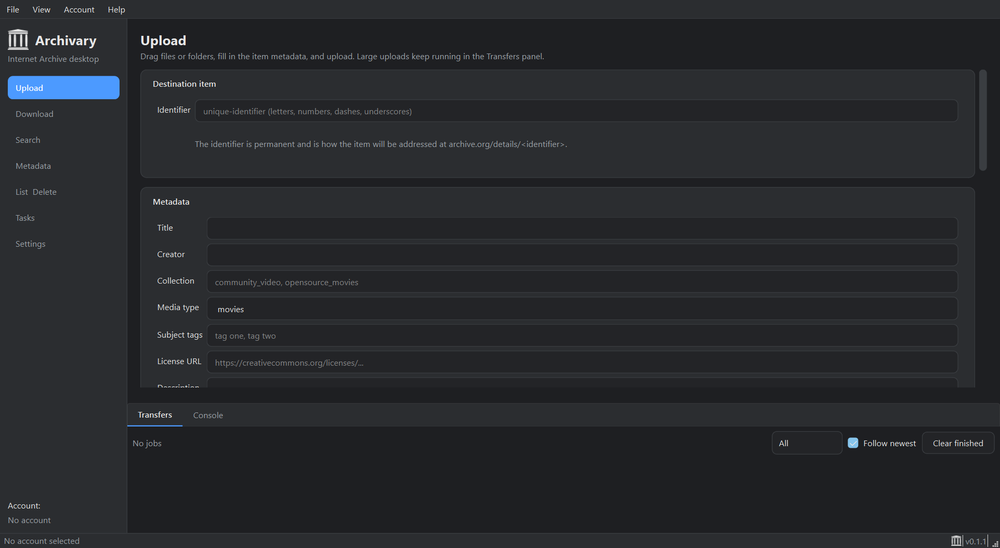

<p align="center">
  
</p>

<h1 align="center">Archivary</h1>

<p align="center"><strong>A cross-platform desktop app for the Internet Archive.</strong></p>

<p align="center">
  
</p>

> **[Read the full User Manual](MANUAL.md)** — a step-by-step guide to every feature.

Archivary wraps the official
[`internetarchive`](https://github.com/jjjake/internetarchive) Python library and
turns the whole `ia` command line — upload, download, search, metadata, listing,
delete, tasks and account setup — into a clean graphical interface for people who
would rather not touch a terminal.

- **Docs:** [User manual](MANUAL.md)
- **Status:** functional build; every panel is wired to the live archive.org APIs.

---

## Highlights

| Area | What you can do |
| --- | --- |
| **Accounts** | Save multiple Internet Archive profiles under names. Secrets live in your OS keychain (encrypted-file fallback). Sign in with email + password to fetch IAS3 keys, paste keys directly, or test the connection. |
| **Upload** | Drag & drop files or folders, fill in item metadata, add arbitrary custom fields, upload many files into one item, preserve folder names, skip unchanged files by checksum, verify with Content-MD5, keep old versions, retry, optionally delete local copies, and batch upload from CSV/Excel. |
| **Download** | Paste an identifier or archive.org URL, filter with globs/formats, skip existing files, resume partial downloads, verify checksums, flatten output, run several downloads at once, and optionally count the download as a view. |
| **Search** | Simple text search or advanced `field:value` queries, media-type and collection filters, sorting, and one-click routing of any result to Download, Metadata or List. Export results to CSV or JSON. |
| **Metadata** | View and edit every field, overwrite vs. append values, remove fields, and batch-edit many items from a spreadsheet. |
| **List & Delete** | Browse every file with size, format, MD5 and SHA-1, then queue files for download or deletion. Deletion requires an explicit confirmation dialog **and** typing the identifier. |
| **Tasks** | Watch the catalog task queue (e.g. derive processing after an upload) with auto-refresh and a per-task log viewer. |
| **Transfers** | A persistent, resizable bottom panel with live speed/ETA and pause, resume, cancel, retry and remove for every job, independent of the tab you are on. |
| **Console** | A raw log panel for troubleshooting, with severity filtering and an opt-in HTTP logging mode. |

Everything is themed light **or** dark and follows the OS setting by default.

---

## Requirements

- Python 3.11 or newer (developed on 3.12)
- PySide6 6.6+
- `internetarchive` 5.5+
- `keyring`, `cryptography`, `requests`, `openpyxl`

## Install and run

```powershell
git clone <your-repo-url> Archivary
cd Archivary
python -m venv .venv
.\.venv\Scripts\python.exe -m pip install -r requirements.txt
.\.venv\Scripts\python.exe run.py
```

On Linux/macOS replace `.venv\Scripts\python.exe` with `.venv/bin/python`.
You can also launch it as a module: `python -m archivary`.

### Windows shortcut

A `Archivary.bat` launcher is included, and the app can be pinned with a normal
Windows shortcut pointing at:

```
Target:   <project>\.venv\Scripts\pythonw.exe
Arguments: "run.py"
Start in: <project>
```

(Using `pythonw.exe` means no console window appears.)

---

## First run

1. Open **Settings** in the left sidebar.
2. Either paste your **IAS3 access key** and **secret key** (from
   <https://archive.org/account/s3.php>), or use email + password and click
   **Fetch keys**.
3. Give the profile a name and click **Save profile**, then **Test connection**.
4. Head to **Upload** or **Download** and get going.

See the [user manual](MANUAL.md) for a full walkthrough of every feature.

---

## Keyboard shortcuts

| Shortcut | Action |
| --- | --- |
| `Ctrl+J` | Show / hide the Transfers & Console panel |
| `Ctrl+1` | Focus the Transfers panel |
| `Ctrl+2` | Focus the Console panel |
| `Ctrl+Q` | Quit |

---

## Where Archivary stores things

| What | Location |
| --- | --- |
| Profiles (no secrets) | `%APPDATA%\Archivary\profiles.json` (Windows) / `~/.config/Archivary/profiles.json` (Linux/macOS) |
| Settings | same folder as profiles, `settings.json` |
| Encrypted credential fallback | same folder, `secrets.enc` (only if no OS keychain is available) |
| Secrets (normal) | OS keychain under the service name **Archivary** |
| Log file | `%LOCALAPPDATA%\Archivary\archivary.log` (Windows) / `~/.config/Archivary/data/archivary.log` |
| Checksum cache | `.../Archivary/data/cache/_checksum_archive.txt` |

---

## Architecture

```
archivary/
  core/            GUI-independent plumbing
    credentials.py   keyring / encrypted-file profile storage
    jobs.py          Qt Job + JobQueue (QThread workers, concurrency limit)
    task.py          CancelToken, Reporter (pause / cancel / progress)
    errors.py        exception -> plain-language error mapping
    logbus.py        logging -> Qt signal bridge
    settings.py      JSON settings store
  services/        wrappers around the internetarchive library
    ia_service.py    upload, download, search, metadata, delete, tasks
    spreadsheet.py   CSV/XLSX batch import and result export
  ui/              PySide6 interface
    main_window.py   sidebar navigation + resizable bottom panel
    theme.py         light / dark / system theming
    job_panel.py     transfer queue UI
    log_panel.py     raw console
    widgets.py       reusable widgets
    tabs/            one module per feature
packaging/         PyInstaller spec
tests/             headless test suite
```

**Design principles**

- The **service layer imports no Qt**. Every network call accepts an optional
  `Reporter`, so the whole backend can be driven from a script or a test.
- Every long operation becomes a **`Job`** on a `QThread` worker, so the UI never
  freezes and multiple large transfers run at once. Pause/cancel are cooperative
  and take effect within one chunk.
- **Uploads** compute MD5 locally and send it as `Content-MD5`, so the progress
  bar reflects real payload and skipping/verification are exact.
- **Downloads** are streamed by Archivary (using the library's item metadata) so
  progress, resume and checksums are fully under our control.
- **Errors** are translated to plain language with an optional "show details"
  path into the console.

---

## Development

```powershell
.\.venv\Scripts\python.exe -m pip install -r requirements-dev.txt
.\.venv\Scripts\python.exe -m pytest -q      # headless test suite
.\.venv\Scripts\ruff.exe check .             # lint
```

The test suite runs offscreen (`QT_QPA_PLATFORM=offscreen` is set automatically)
and covers credentials, the job queue, pause/cancel, spreadsheet parsing, upload
progress/checksum skipping, error mapping and a UI smoke test.

You can drive the backend without the GUI:

```python
from archivary.services.ia_service import IAService
svc = IAService()
print(svc.list_files("nasa", glob_patterns=["*meta.xml"]))
print(svc.search("identifier:nasa", fields=["identifier", "title"], limit=5))
```

## Building a standalone executable

PyInstaller cannot cross-compile, so build once per target OS:

```powershell
.\.venv\Scripts\python.exe packaging\make_icons.py            # once, or after changing the logo
.\.venv\Scripts\pyinstaller.exe packaging\archivary.spec --noconfirm
```

The result is written to `dist/`: `Archivary.exe` on Windows, a bare `Archivary`
binary on Linux (the workflow wraps it as `Archivary-linux.tar.gz`), and
`Archivary.app` on macOS. The
[`.github/workflows/build.yml`](.github/workflows/build.yml) workflow builds all
three on their native runners and uploads them as artifacts.

For a compiled build you can substitute [Nuitka](https://nuitka.net/).

```powershell
.\.venv\Scripts\python.exe -m nuitka --standalone --enable-plugin=pyside6 run.py
```

---

## Troubleshooting

| Symptom | Cause / fix |
| --- | --- |
| `Access Denied - You lack sufficient privileges to write to those collections` | Your account can't upload into the collection you set. Clear the **Collection** field or use an open one (`opensource`, `community`, …). |
| `Sign-in failed` / 401 | Wrong or missing IAS3 keys. Re-copy them from <https://archive.org/account/s3.php>. |
| `Item already exists` | Choose a different identifier or enable **Keep old version**. |
| `Internet Archive is busy` (503) | Temporary S3 overload; Archive.org retries automatically (tune **Retries on overload**). |
| Upload seems stuck | Open the **Console** and enable **Raw HTTP logging** to see the request state. |
| Download checksum mismatch | The file was removed automatically; retry the download. |

---

## License

Archivary is an independent interface to archive.org. The `internetarchive`
library it depends on is licensed **AGPL-3.0**.
